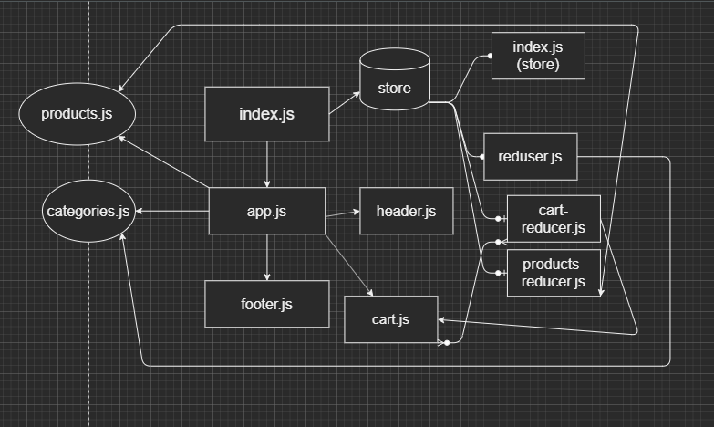

# lab-name: storefront

### Author: Yousef AlShun

### Links and Resources

#### Submission Request
- [submission PR](https://github.com/yousef-401-advanced-javascript/storefront/pull/2)
- [GitHub actions](https://github.com/yousef-401-advanced-javascript/storefront/actions)
- [GitHub deploy](https://yousef-401-advanced-javascript.github.io/storefront/)
- [Netlify deploy](https://frosty-blackwell-5c8179.netlify.app/)

#### Resources
- React Bootstrap

### Documentation
- [React Hello World](https://reactjs.org/docs/hello-world.html)
- [SASS](https://sass-lang.com/documentation)
- [material-ui](https://material-ui.com/getting-started/installation/)
- [Redux](https://redux.js.org/introduction/getting-started)

### Setup
- install the packages by writing the command npm i (will install locally)
- start the app by writing npm start

### How to use the App
- chose the category that you want to buy from. (that will show you the item that related to chosen category)
- you can add any item to your cart .
- the number of the item that selected will shown at the header.
- you can open your cart to see the items

### UML
